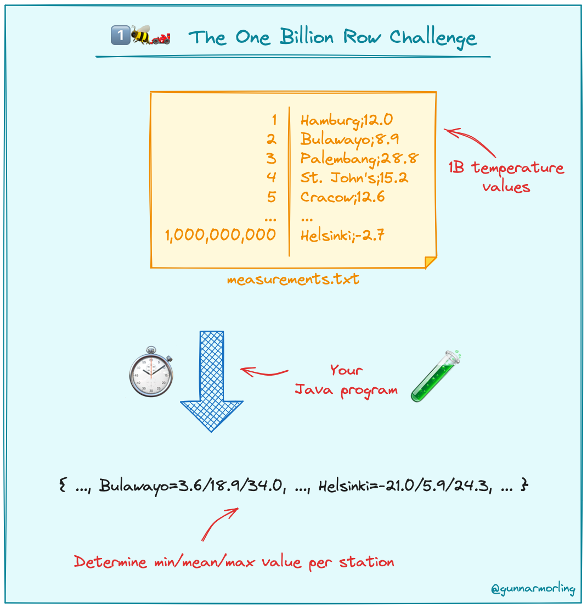

# 1️⃣🐝🏎️ The One Billion Row Challenge

_Status Jan 1: This challenge is [open for submissions](https://www.morling.dev/blog/one-billion-row-challenge/)!_

The One Billion Row Challenge (1BRC) is a fun exploration of how far modern Java can be pushed for aggregating one billion rows from a text file.
Grab all your (virtual) threads, reach out to SIMD, optimize your GC, or pull any other trick, and create the fastest implementation for solving this task!



The text file contains temperature values for a range of weather stations.
Each row is one measurement in the format `<string: station name>;<double: measurement>`, with the measurement value having exactly one fractional digit.
The following shows ten rows as an example:

```
Hamburg;12.0
Bulawayo;8.9
Palembang;38.8
St. John's;15.2
Cracow;12.6
Bridgetown;26.9
Istanbul;6.2
Roseau;34.4
Conakry;31.2
Istanbul;23.0
```

The task is to write a Java program which reads the file, calculates the min, mean, and max temperature value per weather station, and emits the results on stdout like this
(i.e. sorted alphabetically by station name, and the result values per station in the format `<min>/<mean>/<max>`, rounded to one fractional digit):

```
{Abha=-23.0/18.0/59.2, Abidjan=-16.2/26.0/67.3, Abéché=-10.0/29.4/69.0, Accra=-10.1/26.4/66.4, Addis Ababa=-23.7/16.0/67.0, Adelaide=-27.8/17.3/58.5, ...}
```

Submit your implementation by Jan 31 2024 and become part of the leaderboard!

## Results

| # | Result (m:s.ms) | Implementation     | JDK | Submitter     |
|---|-----------------|--------------------|-----|---------------|
| 1.|        00:14.848| [link](https://github.com/gunnarmorling/1brc/blob/main/src/main/java/dev/morling/onebrc/CalculateAverage_spullara.java)| 21.0.1-graalce| [Sam Pullara](https://github.com/spullara)|
| 2.|        00:18.865| [link](https://github.com/gunnarmorling/1brc/blob/main/src/main/java/dev/morling/onebrc/CalculateAverage_palmr.java)| 21.0.1-open| [Nick Palmer](https://github.com/palmr)|
| 3.|        00:21.853| [link](https://github.com/gunnarmorling/1brc/blob/main/src/main/java/dev/morling/onebrc/CalculateAverage_filiphr.java)| 21.0.1-graal| [Filip Hrisafov](https://github.com/filiphr)|
| 4.|        00:23.366| [link](https://github.com/gunnarmorling/1brc/pull/5/)| 21.0.1-open   | [Roy van Rijn](https://github.com/royvanrijn)|
| 5.|        00:38.106| [link](https://github.com/gunnarmorling/1brc/blob/main/src/main/java/dev/morling/onebrc/CalculateAverage_seijikun.java)| 21.0.1-open   | [Markus Ebner](https://github.com/seijikun)|
| 6.|        00:38.510| [link](https://github.com/gunnarmorling/1brc/blob/main/src/main/java/dev/morling/onebrc/CalculateAverage_bjhara.java)| 21.0.1-open   | [Hampus Ram](https://github.com/bjhara)|
| 7.|        00:38.819| [link](https://github.com/gunnarmorling/1brc/blob/main/src/main/java/dev/morling/onebrc/CalculateAverage_richardstartin.java)| 21.0.1-open   | [Richard Startin](https://github.com/richardstartin)|
| 8.|        00:50.547| [link](https://github.com/gunnarmorling/1brc/blob/main/src/main/java/dev/morling/onebrc/CalculateAverage_padreati.java)| 21.0.1-open   | [Aurelian Tutuianu](https://github.com/padreati)|
| 9.|        00:53.679| [link](https://github.com/gunnarmorling/1brc/blob/main/src/main/java/dev/morling/onebrc/CalculateAverage_criccomini.java)| 21.0.1-open   | [Chris Riccomini](https://github.com/criccomini)|
|10.|        00:57.141| [link](https://github.com/gunnarmorling/1brc/blob/main/src/main/java/dev/morling/onebrc/CalculateAverage_truelive.java)| 21.0.1-open   | [Roman Schweitzer](https://github.com/truelive)|
|11.|        02:00.101| [link](https://github.com/gunnarmorling/1brc/blob/main/src/main/java/dev/morling/onebrc/CalculateAverage_khmarbaise.java)| 21.0.1-open   | [khmarbaise](https://github.com/khmarbaise)|
|12.|        02:08.315| [link](https://github.com/gunnarmorling/1brc/blob/main/src/main/java/dev/morling/onebrc/CalculateAverage_itaske.java)| 21.0.1-open   | [itaske](https://github.com/itaske)|
|13.|        02:08.650| [link](https://github.com/gunnarmorling/1brc/blob/main/src/main/java/dev/morling/onebrc/CalculateAverage_kuduwa_keshavram.java)| 21.0.1-open   | [Kuduwa Keshavram](https://github.com/kuduwa_keshavram)|
|14.|        04:13.449| [link](https://github.com/gunnarmorling/onebrc/blob/main/src/main/java/dev/morling/onebrc/CalculateAverage.java) (baseline)| 21.0.1-open   | [Gunnar Morling](https://github.com/gunnarmorling)|

See [below](#entering-the-challenge) for instructions how to enter the challenge with your own implementation.

## Prerequisites

[Java 21](https://openjdk.org/projects/jdk/21/) must be installed on your system.

## Running the Challenge

This repository contains two programs:

* `dev.morling.onebrc.CreateMeasurements` (invoked via _create\_measurements.sh_): Creates the file _measurements.txt_ in the root directory of this project with a configurable number of random measurement values
* `dev.morling.onebrc.CalculateAverage` (invoked via _calculate\_average\_baseline.sh_): Calculates the average values for the file _measurements.txt_

Execute the following steps to run the challenge:

1. Build the project using Apache Maven:

    ```
    ./mvnw clean verify
    ```

2. Create the measurements file with 1B rows (just once):

    ```
    ./create_measurements.sh 1000000000
    ```

    This will take a few minutes.
    **Attention:** the generated file has a size of approx. **12 GB**, so make sure to have enough diskspace.

3. Calculate the average measurement values:

    ```
    ./calculate_average.sh
    ```

    The provided naive example implementation uses the Java streams API for processing the file and completes the task in ~2 min on environment used for [result evaluation](#evaluating-results).
    It serves as the base line for comparing your own implementation.

4. Optimize the heck out of it:

    Adjust the `CalculateAverage` program to speed it up, in any way you see fit (just sticking to a few rules described below).
    Options include parallelizing the computation, using the (incubating) Vector API, memory-mapping different sections of the file concurrently, using AppCDS, GraalVM, CRaC, etc. for speeding up the application start-up, choosing and tuning the garbage collector, and much more. 

## Flamegraph/Profiling

A tip is that if you have [jbang](https://jbang.dev) installed, you can get a flamegraph of your program by running 
[async-profiler](https://github.com/jvm-profiling-tools/async-profiler) via [ap-loader](https://github.com/jvm-profiling-tools/ap-loader):

`jbang --javaagent=ap-loader@jvm-profiling-tools/ap-loader=start,event=cpu,file=profile.html -m dev.morling.onebrc.CalculateAverage_yourname target/average-1.0.0-SNAPSHOT.jar`

or directly on the .java file:

`jbang --javaagent=ap-loader@jvm-profiling-tools/ap-loader=start,event=cpu,file=profile.html src/main/java/dev/morling/onebrc/CalculateAverage_yourname`

When you run this, it will generate a flamegraph in profile.html. You can then open this in a browser and see where your program is spending its time.

## Rules and limits

* Any of these Java distributions may be used:
    * Any builds provided by [SDKMan](https://sdkman.io/jdks)
    * Early access builds available on openjdk.net may be used (including EA builds for OpenJDK projects like Valhalla)
    * Builds on [builds.shipilev.net](https://builds.shipilev.net/openjdk-jdk-lilliput/)
If you want to use a build not available via these channels, reach out to discuss whether it can be considered.
* No external library dependencies may be used
* Implementations must be provided as a single source file
* The computation must happen at application _runtime_, i.e. you cannot process the measurements file at _build time_
(for instance, when using GraalVM) and just bake the result into the binary
* Input value ranges are as follows:
    * Station name: non null UTF-8 string of min length 1 character and max length 100 characters
    * Temperature value: non null double between -99.9 (inclusive) and 99.9 (inclusive), always with one fractional digit
* There is a maximum of 10,000 unique station names
* Implementations must not rely on specifics of a given data set, e.g. any valid station name as per the constraints above and any data distribution (number of measurements per station) must be supported

## Entering the Challenge

To submit your own implementation to 1BRC, follow these steps:

* Create a fork of the [onebrc](https://github.com/gunnarmorling/onebrc/) GitHub repository.
* Create a copy of _CalculateAverage.java_, named _CalculateAverage\_<your_GH_user>.java_, e.g. _CalculateAverage\_doloreswilson.java_.
* Make that implementation fast. Really fast.
* Create a copy of _calculate_average_baseline.sh_, named _calculate\_average\_<your_GH_user>.sh_, e.g. _calculate\_average\_doloreswilson.sh_.
* Adjust that script so that it references your implementation class name. If needed, provide any JVM arguments via the `JAVA_OPTS` variable in that script.
* OpenJDK 21 is the default. If a custom JDK build is required, include the SDKMAN command `sdk use java [version]` in the launch shell script prior to application start.
* (Optional) If you'd like to use native binaries (GraalVM), adjust the _pom.xml_ file so that it builds that binary.
* Create a pull request against the upstream repository, clearly stating
  * The name of your implementation class.
  * The execution time of the program on your system and specs of the same (CPU, number of cores, RAM). This is for informative purposes only, the official runtime will be determined as described below.
* I will run the program and determine its performance as described in the next section, and enter the result to the scoreboard.

**Note:** I reserve the right to not evaluate specific submissions if I feel doubtful about the implementation (I.e. I won't run your Bitcoin miner ;).

If you'd like to discuss any potential ideas for implementing 1BRC with the community,
you can use the [GitHub Discussions](https://github.com/gunnarmorling/onebrc/discussions) of this repository.
Please keep it friendly and civil.

The challenge runs until Jan 31 2024.
Any submissions (i.e. pull requests) created after Jan 31 2024 23:59 UTC will not be considered.

## Evaluating Results

Results are determined by running the program on a [Hetzner Cloud CCX33 instance](https://www.hetzner.com/cloud) (8 dedicated vCPU, 32 GB RAM).
The `time` program is used for measuring execution times, i.e. end-to-end times are measured.
Each contender will be run five times in a row.
The slowest and the fastest runs are discarded.
The mean value of the remaining three runs is the result for that contender and will be added to the results table above.
The exact same _measurements.txt_ file is used for evaluating all contenders.

If you'd like to spin up your own box for testing on Hetzner Cloud, you may find these [set-up scripts](https://github.com/gunnarmorling/cloud-boxes/) (based on Terraform and Ansible) useful.
Note this will incur cost you are responsible for, I am not going to pay your cloud bill :)

## Prize

If you enter this challenge, you may learn something new, get to inspire others, and take pride in seeing your name listed in the scoreboard above.
Rumor has it that the winner may receive a unique 1️⃣🐝🏎️ t-shirt, too!

## FAQ

_Q: Can I use Kotlin or other JVM languages other than Java?_\
A: No, this challenge is focussed on Java only. Feel free to inofficially share implementations significantly outperforming any listed results, though.

_Q: Can I use non-JVM languages and/or tools?_\
A: No, this challenge is focussed on Java only. Feel free to inofficially share interesting implementations and results though. For instance it would be interesting to see how DuckDB fares with this task.

_Q: I've got an implementation—but it's not in Java. Can I share it somewhere?_\
A: Whilst non-Java solutions cannot be formally submitted to the challenge, you are welcome to share them over in the [Show and tell](https://github.com/gunnarmorling/1brc/discussions/categories/show-and-tell) GitHub discussion area.

_Q: Can I use JNI?_\
A: Submissions must be completely implemented in Java, i.e. you cannot write JNI glue code in C/C++. You could use AOT compilation of Java code via GraalVM though, either by AOT-compiling the entire application, or by creating a native library (see [here](https://www.graalvm.org/22.0/reference-manual/native-image/ImplementingNativeMethodsInJavaWithSVM/).

_Q: What is the encoding of the measurements.txt file?_\
A: The file is encoded with UTF-8.

_Q: Can I make assumptions on the names of the weather stations showing up in the data set?_\
A: No, while only a fixed set of station names is used by the data set generator, any solution should work with arbitrary UTF-8 station names
(for the sake of simplicity, names are guaranteed to contain no `;` character).

_Q: Can I copy code from other submissions?_\
A: Yes, you can. The primary focus of the challenge is about learning something new, rather than "winning". When you do so, please give credit to the relevant source submissions. Please don't re-submit other entries with no or only trivial improvements.

_Q: Which operating system is used for evaluation?_\
A: Fedora 39.

_Q: Why_ 1️⃣🐝🏎️ _?_\
A: It's the abbreviation of the project name: **One** **B**illion **R**ow **C**hallenge.

## License

This code base is available under the Apache License, version 2.

## Code of Conduct

Be excellent to each other!
More than winning, the purpose of this challenge is to have fun and learn something new.
